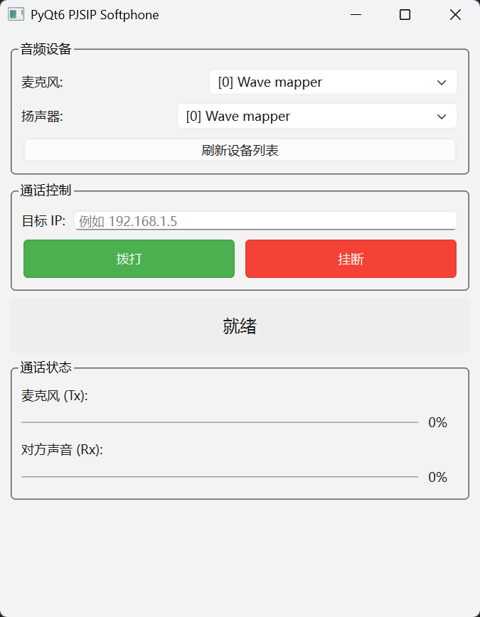

# PySIP

使用 PyQt6 编写的简单图形化程序，用于接打 SIP 电话



## 使用

环境：Windows 11

在 Windows 上只能通过 MSYS2 MinGW64 环境编译 PJSUA2，并且使用其自带的 Python 环境运行本程序

### 1. 编译 PJSIP

https://docs.pjsip.org/en/latest/get-started/posix/build_instructions.html


### 2. 编译 PJSUA2

https://docs.pjsip.org/en/2.10/api/pjsua2.html

### 3. 安装依赖

```bash
pacman -S mingw-w64-x86_64-python-pyqt6
```

### 4. 运行

```bash
python main.py
```